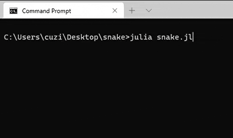

# snake
Snake game in the console with a gamepad controller in Julia.

On Unix you can use WASD to control the snake, on Windows you can also choose to use a gamepad controller.
It was tested with a Logitech Rumble Gamepad F510, but anything that supports the Windows [XInput Game Controller API](https://docs.microsoft.com/en-us/windows/win32/api/xinput/) (XInput1_4.dll) should work.

Your terminal app needs to support emojis.

## Run
```bash
julia snake.jl
```

## Screenshot
